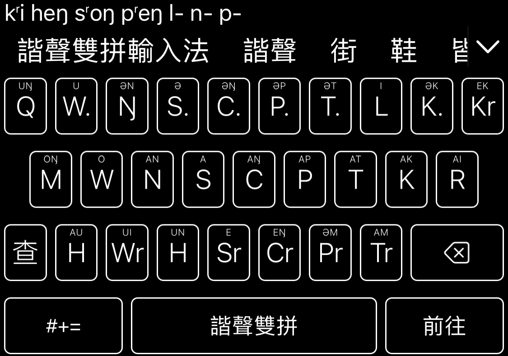

# 諧聲上古音輸入法（全拼、雙拼）

基於上古音諧聲的[Rime](https://rime.im)傳統漢字輸入方案

## 簡介

拼寫信息請參考[描述](src/description.md)文件；字典主要由中古韻圖、諧聲資料和詩經韻部反推生成，目前還沒有校對完全

雙拼鍵盤佈局請參考[雙拼聲母鍵盤圖](src/double_first_letter(consonant+medial).txt)和[雙拼韻母鍵盤圖](src/double_second_letter(rhyme).txt)文件
* 音節首拼：上古聲母諧聲類+介音
* 音節尾拼：上古韻母
* 韻母可以用“;”代替，實現簡碼

按“`”鍵使用[朙月拼音](https://github.com/rime/rime-luna-pinyin)反查上古音，當然也可以替換成其它反查輸入方式（請確認已安裝反查使用的字典）

在iOS上使用[倉hamster](https://github.com/imfuxiao/Hamster)App部署諧聲雙拼輸入法時，可以安裝[專用鍵盤](hamster_supplements/clear_keyboard.custom.yaml)和[高對比配色](hamster_supplements/hamster_color_schemas.custom.yaml)（據說hamster很快更新可以調整字號，就不需要高對比配色也能看清鍵盤了）；鍵盤文件可以在設置中導入，配色文件直接放至Rime文件夾部署即可，新手請參考[倉wiki](https://github.com/imfuxiao/Hamster/wiki)

配套iOS的鍵盤保留了上下劃常用數字和標點，請劃一劃試試；上劃Space切換英文，Space兩側的鍵是簡碼用來替換韻母的“;”字符；使用反查請確認反查使用的字典也已安裝

授權條款：見 [LICENSE](LICENSE.txt)
